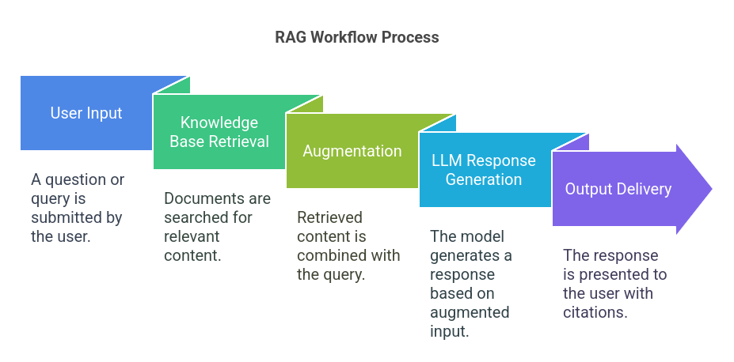
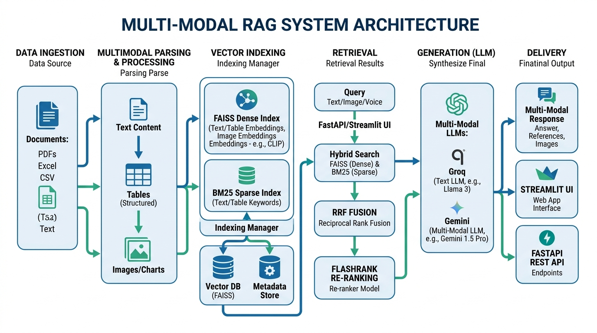

# ⚡ Enterprise Multi-Modal RAG System


A production-grade **Multi-Modal Retrieval-Augmented Generation (RAG)** application powered by **Groq & Gemini LLMs**, **SentenceTransformers**, **FAISS + BM25 Hybrid Search**, **FlashRank Cross-Encoder Re-ranking**, and a **Streamlit Web Dashboard** alongside a **FastAPI REST API**. It ingests text, tables, and images/charts from PDF files and synthesizes multi-modal answers.

---

## 🔄 RAG Workflow Process



The system processes queries through a five-stage pipeline:

1. **User Input**: The user submits a query, question, or document request through the Streamlit interface or the FastAPI REST endpoint.
2. **Knowledge Base Retrieval**: The system performs a hybrid dense-sparse search over the ingested document indexes:
   * **Dense Search**: Compares sentence embeddings using FAISS.
   * **Sparse Search**: Performs exact keyword matching using BM25.
   * **Re-ranking**: FlashRank re-scores and filters the top matching chunks to ensure maximum relevance.
3. **Augmentation**: The retrieved text snippets, formatted Markdown tables, and visual descriptions are combined with the user's original prompt along with conversational history to construct an augmented context.
4. **LLM Response Generation**: The LLM (e.g., Groq `llama-3.3-70b-versatile` or Gemini) processes the augmented prompt, drafting a response strictly grounded in the retrieved content.
5. **Output Delivery**: The final answer is delivered back to the user, displaying references, direct page citations, clean Markdown tables, and embedded images or charts.

---

## 🏗️ Multi-Modal RAG System Architecture



The system architecture is structured into six modular layers:

1. **Data Ingestion**: Support for multiple file formats including PDFs, CSVs, Excel spreadsheets (`.xlsx`), and raw text files.
2. **Multimodal Parsing & Processing**: 
   * **Text Content**: Extracted directly and split into chunks.
   * **Tables**: Extracted using structural table identifiers, formatted as Markdown tables, and summarized.
   * **Images & Charts**: Extracted and visually summarized using `gemini-1.5-flash` to make visual content searchable.
3. **Vector Indexing & Storage**:
   * **FAISS Dense Index**: Stores semantic vector representations using SentenceTransformers (`all-MiniLM-L6-v2`) for text chunks, table summaries, and image descriptions.
   * **BM25 Sparse Index**: Stores lexical indices of text/table keywords for keyword matching.
   * **Vector DB & Metadata Store**: Combines vector lookup with document mapping metadata.
4. **Retrieval Engine**:
   * **Hybrid Search**: Interrogates both dense (FAISS) and sparse (BM25) indexes concurrently.
   * **Reciprocal Rank Fusion (RRF)**: Merges sparse and dense search candidates into a unified rank list.
   * **FlashRank Re-ranking**: Employs cross-encoders (`ms-marco-TinyBERT-L-2-v2`) to re-score candidates, selecting the top matches.
5. **Orchestrated Generation**: Passes context-grounded prompts to high-performance LLMs (Groq `llama-3.3-70b-versatile` or Gemini) to synthesize accurate responses.
6. **Delivery**: Distributes final answers with source citations, Markdown tables, and visual assets via Streamlit or FastAPI endpoints.

---

## 🌟 Key Features

* 📸 **Multi-Modal Parsing**: Extracts text chunks, detects and formats tables to Markdown, and extracts images (diagrams, charts, graphs) from PDFs.
* 🧠 **Gemini Visual Summarization**: Automatically describes tables and extracted images/charts using `gemini-1.5-flash`, indexing the generated text summaries for hybrid dense-sparse search.
* 🔍 **Hybrid Search (BM25 + FAISS)**: Combines keyword search (sparse BM25) with semantic embeddings (dense FAISS) via Reciprocal Rank Fusion (RRF).
* ⚡ **FlashRank Re-Ranking**: Uses CPU cross-encoders (`ms-marco-TinyBERT-L-2-v2`) to re-rank top candidates for optimal relevance.
* 🚀 **Groq & Gemini Orchestration**: Powered by Groq `llama-3.3-70b-versatile` and Gemini models for high-quality, sub-second responses.
* 📑 **Source Citations & Page Tracking**: Cites exact PDF filenames, 1-indexed page numbers, and snippet previews. Renders tabular data and displays the actual images/charts in the Streamlit Q&A conversation.
* 🌐 **Interactive Streamlit UI**: User-friendly chat interface with drag-and-drop file uploading and sidebar controls.
* 📡 **FastAPI REST Backend**: Exposes `/api/query`, `/api/upload`, and `/api/health` endpoints with interactive Swagger documentation.

---

## 🛠️ How I Built It: Step-by-Step Architecture

### 1. Ingestion & Multi-Modal Extraction (`dataloader.py`)
Loads multi-format documents (PDFs, TXT, CSV, DOCX, XLSX) and performs multi-modal parsing on PDFs:
* **Standard Text Chunks**: Extracted and tagged with page metadata.
* **Tables**: Extracted using layout table finders, mapped to Markdown tables, and summarized using Gemini to build searchable index representations.
* **Images/Charts**: Saved to `data/extracted_images/` and passed to `gemini-1.5-flash` with a detail-oriented vision description prompt. The description is embedded to allow semantic image search.

### 2. Chunking & Embeddings (`embedding.py`)
Splits large text documents into logical chunks using `RecursiveCharacterTextSplitter` (chunk size: `1000`, overlap: `200`). Chunks, table summaries, and image summaries are vectorized using `all-MiniLM-L6-v2` SentenceTransformer embeddings, yielding `384`-dimension vectors.

### 3. FAISS Vector Database & BM25 Keyword Search (`vectorstore.py`)
* Implements `FaissVectorStore` with `faiss.IndexFlatL2` for high-speed dense vector similarity retrieval on CPU.
* Builds a sparse `rank_bm25` (specifically `BM25Okapi`) keyword index over the corpus.

### 4. Reciprocal Rank Fusion (RRF)
Merges candidate lists from dense FAISS search and sparse BM25 keyword search:
$$RRF(d) = \sum_{m \in M} \frac{1}{60 + \text{rank}_m(d)}$$
This matches exact keywords/codes as well as semantic topics.

### 5. FlashRank Cross-Encoder Re-ranking
Integrates the **FlashRank** re-ranker model (`ms-marco-TinyBERT-L-2-v2`) to re-score the merged RRF search candidates against the user query, selecting the top 3-5 matches.

### 6. Grounded LLM Orchestration (`search.py`)
Integrates Groq's high-speed API (`llama-3.3-70b-versatile`) and Gemini. The orchestration engine enforces strict context-grounded rules: the LLM must only use retrieved context, cite page numbers directly, output Markdown tables, reference images, and track conversation history.

### 7. Web Interface & API Hosting (`ui.py`, `api.py`)
* **Streamlit UI**: Displays conversational memory, renders table content as clean interactive widgets, and displays cited images directly inside the app.
* **FastAPI Server**: Hosts standard JSON Q&A endpoints.

---

## 📁 Repository Structure

```text
├── data/                  # Storage folder for PDFs, TXT, CSV, DOCX, XLSX files
│   └── extracted_images/  # Extracted images and charts from parsed PDFs
├── src/
│   └── rag/
│       ├── app.py         # Terminal CLI entry point
│       ├── api.py         # FastAPI REST server
│       ├── dataloader.py  # Multi-modal document ingestion & extraction
│       ├── embedding.py   # Text chunking & SentenceTransformer embeddings
│       ├── search.py      # Conversational RAG engine with Groq & Gemini
│       ├── ui.py          # Streamlit Web Application
│       ├── patch_uuid.py  # Utility to patch uuid_utils dependency blocks
│       ├── test_multimodal.py # Dry-run validation script
│       └── vectorstore.py # FAISS + BM25 hybrid index & FlashRank reranker
├── .env                   # Environment variables (GROQ_API_KEY, GEMINI_API_KEY)
├── pyproject.toml         # UV package configuration & dependencies
└── README.md              # Project documentation
```

---

## 🛠️ Quickstart Guide

### 1. Prerequisites & Setup
Ensure you have Python 3.10+ and `uv` installed.

```bash
# Clone the repository
git clone https://github.com/Arjit005/RAG.git
cd RAG

# Install dependencies using uv
uv sync
```

### 2. Configure Environment Variables
Create a `.env` file in the root directory and add your API keys:

```env
GROQ_API_KEY=your_groq_api_key_here
GEMINI_API_KEY=your_gemini_api_key_here
```

---

## 🚀 Running the Application

### Option A: Streamlit Interactive Web App (Recommended)
```bash
uv run streamlit run src/rag/ui.py
```
Open `http://localhost:8501` in your browser.

### Option B: FastAPI REST Server
```bash
uv run uvicorn main:app --reload --port 8000
```
or simply:
```bash
python main.py
```
Interactive API documentation is available at `http://localhost:8000/docs`.

### Option C: Terminal CLI
```bash
uv run python src/rag/app.py
```

